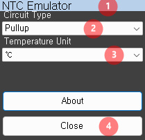
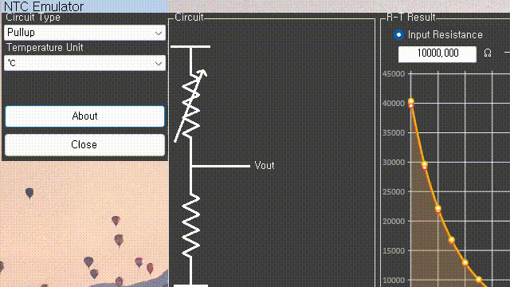
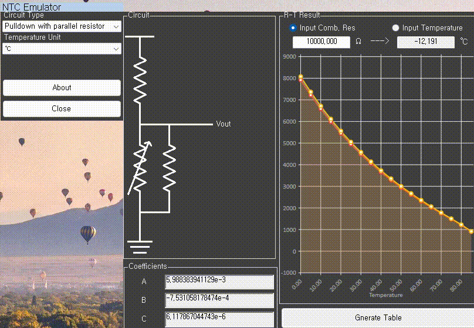
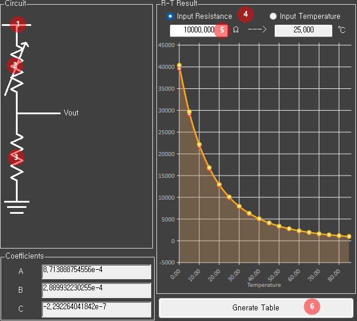
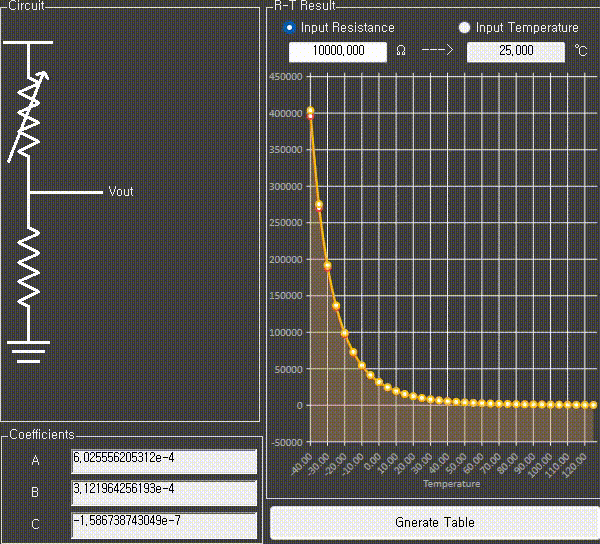

# NTC-Emulator

A program that helps you calculate the expected temperature and resistance when using NTC, and writes C or other language code.

This program was developed in a .NET Framework 4.8.1 environment.

# Limitation

1. The code generated by this program does not output temperature values ​​other than NTC parameters.

2. It supports deviation compensation at 25℃, but this does not compensate for all types of noise.

# Reference
Knowledge : <https://www.ametherm.com/thermistor/ntc-thermistors-steinhart-and-hart-equation>

Graph Expression : [LiveCharts](https://v0.lvcharts.com/)

# How to use
## main panel layout

1. Moving bar : When you want to move the program's position, click and drag this part to relocate it.

2. Select the circuit to be calculated based on the position of the NTC (pull-up/pull-down) and the presence or absence of a parallel resistor.

3. Determine the unit of temperature to be displayed.

4. Exit the program

## Configuration panel

1. Enter the VCC value to be applied to the circuit. Clicking the image will open an input field.

2. NTC Image: Enter the RT values. Clicking the image will open an input field.

3. Resistor Images: Enter the parameters for the divider resistor and parallel resistor. Clicking the image will open an input field.

4. Select whether the input values matching the R-T are in resistance or temperature, and derive the result.

5. Generate the code for use in the actual project based on the information provided.
